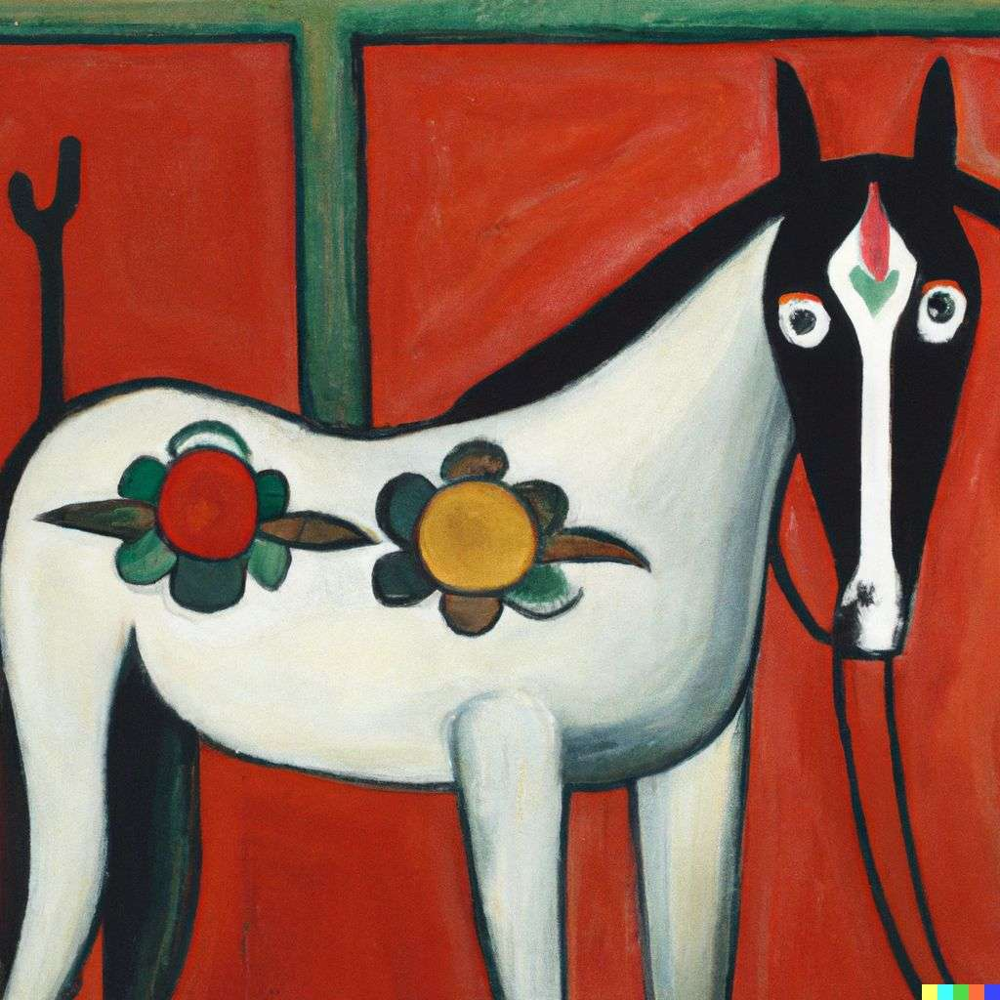

### Traditional Deployment: 
- pre containerisation and orchestration :
	- install node 
	- install pm2 
	- monitor each machine 
- better solution -> containers :
	- Use containers 
	- vendor independent 
	- install docker 
	- docker run image -> generates a mini container that will be started , universally deployable 
	- another container runtimes like podman 

### Container Orchestration 
- think like orchestra orchestrator.
- have bunch of machines , local + remote , have a process that could "manage" all these machines and some machines goes down, it could start them again
- starting the machine, installing docker and running docker on the machine.
- until we have container orcheastration , which looks at our cluster (bunch of machines) and given requirements , it orchestrates the thing and constantly keeps track depending on the specficiation that we give it.
- kubernetes -> k8s
- useful when
	- we have docker images in the docker registry and want to deploy it in a cloud native fashion.
	- we wan to not worry about patching, crashes. We want the system to auto-heal.
	- autoscale with some simple constructs.
	- we want to observe our complete system in a simple method.
- Example k8s cluster:
	![[Screenshot 2024-06-01 at 7.17.29 PM.png]]
- Before k8s, using ASG groups:
	- ![[Screenshot 2024-06-01 at 7.19.07 PM.png]]
	- load balancer as a orpcheastrator and redirectors to different machines.
- Frontend Deployment (using Vercel)
	- ![[Screenshot 2024-06-01 at 7.19.46 PM.png]]
- generally if you dont have a very big application , you don't need a very big server to handle load and single machine suffices.
- Deploying Frontend Applications(using  CDN + S3):
	- generate HTML,CSS,JS files using ```npm run build ```
	- deploy them on a object store like S3.
	- request goes through CDN , and goes to S3.
	- when users require that files, we return them fast using CDN.
	- ![[Screenshot 2024-06-01 at 7.22.25 PM.png]]

### Deploying on k8s:
- you frontend , backend are all pods in your k8s cluster.
- ![[Screenshot 2024-06-01 at 7.25.03 PM.png]]

-  start a bunch of machines - > a k8s cluster; and install and start k8s on all 4 of these machines.
- some of these machine as workers , and some of them start as master. need to create distinction , generally 1 master and 3 workers for a medium size project.
- role of the master node -> developer sshs to  to this IP and requests resources like please find these resources on.
- master decides based on load capacity what workers to assign resources and to scale up/down resources. this thing that the master node starts is called a pod.
- a single pod can run multiple containers -> a pod and a container are different things.
- a pod can be thought of a small machine inside a big node , which can run multiple containers.

### Nodes:
- 2 types of nodes:
	- Master Node -> Control Plane -> node that takes care of deploying the container/ healing them /listening to the k8s cluster.
		 - ![[Screenshot 2024-06-01 at 7.41.12 PM.png]]
		 - **API Server** -> where the developer sends requests(HTTP). hit by multiple things, as well as some of these processes as well.
			 - does authorization checks.
			 - pod creation logic -> put into etcd -> like redis (a kv store) -> but a distributed database 
			 - if we have multiple master nodes, they can share data from each other.
		- does by the kube-scheduler -> run as a background process and  checks if a pod that i should add ?
		 - kube-controller-manager -> runs a inf loop and check if the deployment controller , jobs controller, does the Replica Set controller needs to do something.
	- Worker Node -> Nodes that actually run your backend / frontend code 
		- ![[Screenshot 2024-06-01 at 7.49.55 PM.png]]
		- kubelet -> process that keeps on running, that checks if there is a pod a need to deploy ? if yes then deploy on container runtime. hit the API server on the master and is hit on the scheduler and the etcd.
		- kube-proxy -> how do you reach the pod when you hit it.

### on-cloud deployment :
- GKE 
- AWS k8s
- vultr
### locally:
- minikube -> oldest one  -> only creates one master node
- kind -> kubernetes inside docker -> can allow k8s inside a docker with both master node and 3 workers on our own machine.
### kubectl -> 
- Kubernetes provides a command line tool for communicating with a Kubernetes cluster's [control plane](https://kubernetes.io/docs/reference/glossary/?all=true#term-control-plane), using the Kubernetes API.


### learnt stuff / to be learn:
![[Screenshot 2024-06-01 at 8.34.34 PM.png]]