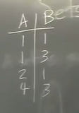

### Why Category Theory ?
- Gateway to pure math -> essential hub of pure math for engineering and computer-scientists.
- Maths is designed - not invented or discovered - patterns that come over and over and category theory outlines them and how they are mapped to each other.
- Quantum physics ,Functional Programming and design patterns are based a lot on Category Theory.

### Generative Effects:
- Also called as cascade effects or emergent propeties.
- (TBD) -> did'nt understand this

### Set 
- (for the course) is a bag of dots.
- 
- Then we can say:
    - $a \in A$
    - $b \in A$
- Empty Set:
    $\phi$
- Any natural numbers:
 $n = {1,2,...n}$
 we then have 
 $\phi = 0$
- Similarly we can have a bag of natural numbers $\N$ , $\Z$, $\R$.
- We can then define $B$ as a set of booleans = ${true,false}$

### Product Sets
- Suppose $A$ and $B$ are sets , then 
$$A * B := {(a,b) | a \in A, b \in B}$$
- So someone comes and indicates $A$ and another one comes and indicates $B$, so together they have indicated $A*B$.
- 
- In category theory , we dont actually think about what are the actual made up on the document, rather what roles do they play, so mathematically in set theory this is different
$ {} $ , $ {\phi} $ , $ {{\phi}} $, in category theory , they are playing the same roles hence they are same.

### Subsets 

- "every element of A is also a element of B"
- $A \subseteq B$
- Other examples:
    - ${1,2,3} \subseteq \N$
    - ${1,2,3.5} \subseteq \N$
    - ${\phi} \subseteq A$ for any arbitary set $A$. 
    - $A \subseteq A$ for any $A$

### Relations

- A relation on sets $A$ and $B$ is just a subset on their product.
$$ R \subseteq A * B$$

- Mapping subsets on a xy plane:
- 

- In a DB world, we can write this as:
    - 

- So any relation from A to B is also a relation from B to A.(commutavity?)
- Relations are very common thing in math. Every function is a relation satisfying 2 properties.
- Order is a relation.
- Equivalence is a relation.
- Tolerance ? is a relation.

### Function

- A function $f$ from $A$ to $B$, denoted as $f : A \rightarrow B$ is a relation $\R \subseteq A*B$ satisfying 2 properties:
    - $\forall a \in A \exist b \in B$ such that $(a,b) \in R$
    - $\forall a , b_1 , b_2 if (a,b_1) \in R and (a,b_2) \in R  then b_1 = b_2$

- 