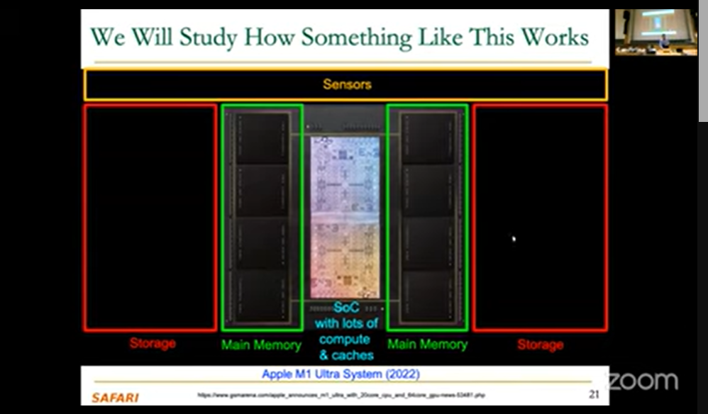
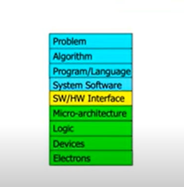
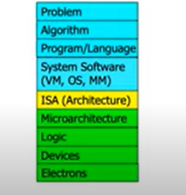

- Four key current directions of computer architecture and SAFARI Research Group:
	- Fundamentally secure/reliable/safe architectures
		- can they make decisions for us that makes us safe
		- code/ data that we can trust.
	- Fundamentally energy-efficient architecture:
		- Memory-centric (Data-centric) architectures
		- making systems more sustaniable with the growing changes in the world.
	- Fundamentally low-latency and predictable architectures
		- want chats want to be predictable over low-latency eg: trams.
	- Architectures for AI/ML,Genomics,Medicine ,Health etc.
		- many domains where we need to analyze data and understand the systems.

- Major Lecture Series under SAFARI Research:
	- First Computer Architecture and Computer Architecture 
		- Digital Design and Computer Architecture
	- Advanced Computer Architecture Course 
		- Computer Architecture 
	- Seminar in Computer Architecture

- Course Links:
	[Courses](https://safari.ethz.ch/courses)

### Basic Goals and Structure of DDCA:
- Goal: How Computers Work(from the ground up)
- How a broad system of modern computers work from the ground up.

### Major High Level Goals of this Course:

- In Digital Design and Computer Architecture:
	- Understand the Basics
	- Understand the principles(of design)
	- Understand the precedents

- Based on such understanding:
	- Learn how a modern computer works underneath the hood.
	- evaluate tradeoffs of different designs and ideas.
	- implement a principled design (a simple microprocessor)
	- learn to systematically debug increasingly complex systems 
	- Hopefully enable us to develop novel, out-of-the-box designs.

- Why these goals ?
	- v.v.imp for deepening CS Knowledge.
	- need to go below the abstraction layer.
	- Useful for:
		- designing better hardware
		- designing better software
		- design better systems 
		- make better tradeoffs in design 
		- understand why computers behave the way they do
		- solve problems better 
		- think "in parallel" -> hardware is inherently parallel, need to orchaestrate 
		- think critically.

### How does a Computer Solve Problems ?

- Orchestrating Electrons 
	- they build a transformation hierarchy.
	- cannot communicate with electrons directly. we have a huge interface mismatch.
	- we translate problem into Algorithm.
	- Algorithm abstracted over program/language/runtime
	- Runs on a System Software.
	- which runs on top of SW/HW interface 
	- Which is implemented on top of micro-archteicture.
	- on top of which logic gate occurs.
	- Devices run on top of it.
	- which manipulate electrons.

- 

- SW/HW Interface and Micro-Architecture region is the narrow /traditional of Computer Architecture.
- but nowadays architecture are much broader and cut across the stack.

### Levels of Transformation:

"The purpose of computing is [to gain] insight." (Rchard Hamming)
- We gain and generate insight by solving problems.
- How do we ensure problems are solved by electrons ?
	- Use algorithms !

- Algorithm:
	- Step-by-step procedure that is guranteed to terminate where each step is precisely stated and can be carried out by a computer.
		- Finiteness
		- Definiteness 
		- Effective Computability 
	- Many algorithms for the same problem.

- Microarchitecture -> RISC-V,ARM etc. implementation of the ISA.
- 
- Digital Logic implements the microarchitecture through the use of gates and logic.

### Computer Architecture:
- is the science and art of designing computing platforms (hardware,interface,system SW and programming model).
- to acheieve a set of design goals.
	- Eg: highest performance on earth on workloads X,Y,Z
	- Eg: longest battery life at a form factor that fis in your pocket with cost < $$$ CHF
	- Eg: best average performance across all known workloads at the best performance/ cost ratio.

- Designing a supercomputer is different from designing a smartphone -> But, many fundamentals principles are similar.

- Differnet platforms , different goals, -> ML Accelerator Chip, 850k cores.

### Axiom:
- To achieve the highest enery efficiency and performance , we must take the expanded view of the computer architecture.
- Co-design/cross design across the hierarchy -> Algorithms to devices.
- Specialize as much as possible -> within the design goals.

### Formal Defn of Computer Architecture:
- The science and art of designing,selecting and interconnecting hardware components and designing the hardware/software interface to create a computing system that meets functional, performance,energy consumption,cost and other specific goals.

### Why study Computer Architecture :

- Enable better systems -> make computers faster, cheaper,smaller and more flexible.
	- By exploiting advances and changes in underlying tech/circuits.
- Enable new applications
	- Life like 3D visualization 20 years ago ? Virtual realiy ?
	- Self-driving cars ?
	- Personalized genomics ? Personalized medicine ?

- Enable better solutions to problems
	- Software innovation is built on trends and changes in computer architecture.
		- \> 50% performance improvement per year has enable this innovation.

- Understand why computers work the way they do.

### Computer Architecture Today 
- Today is a very exciting time to study computer architecture.
- Industry is in a large paradigm shift (to novel architectures)
	- many different potential system designs possible.
	- Every component and its interaces, as well as entire architecture is being re-imagined.

- Many difficult problems motivating and caused by the shift:
	- Huge power for data and new data-intensive applications.
	- Power/energy/thermal constraints
	- Complexity of design 
	- Difficulties in tech scaling
	- Memory bottleneck
	- Reliability problems
	- Programmability problems.
	- Security and privacy issues.

### Innovations can be driven by hierarchy, plenty of oppurtunities at the bottom. i.e physics. Plenty of room where we can build devices and can directly enable us to manipulate fundamental atoms at the direct level.

- Rather there is plenty of room at the top and at the bottom but much more so when we communicate well between and optimize across the top and the bottom.

### Many Intersting things are happening today in computer architecture.

- Performance, Energy Efficiency, Sustanibility
- Reliability 
- Safety
- Security and Privacy 
- More demanding workloads
- New(device) technologies.
	- building accelerators
	- like Apple M1 
	- Youtube Video Coding Unit.
	- Tesla Full Driving Chip.
- 
