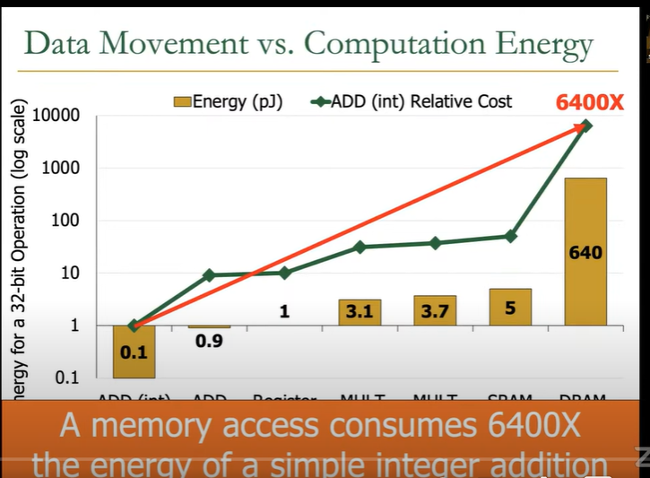
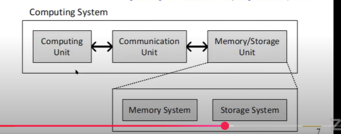
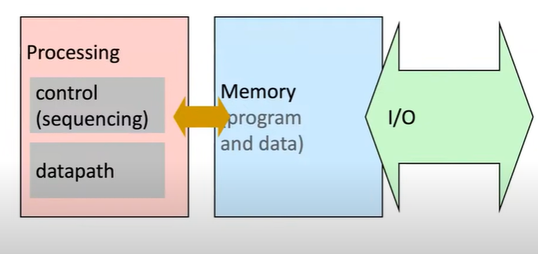
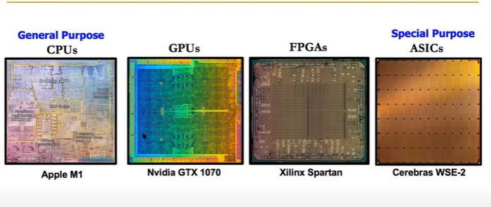
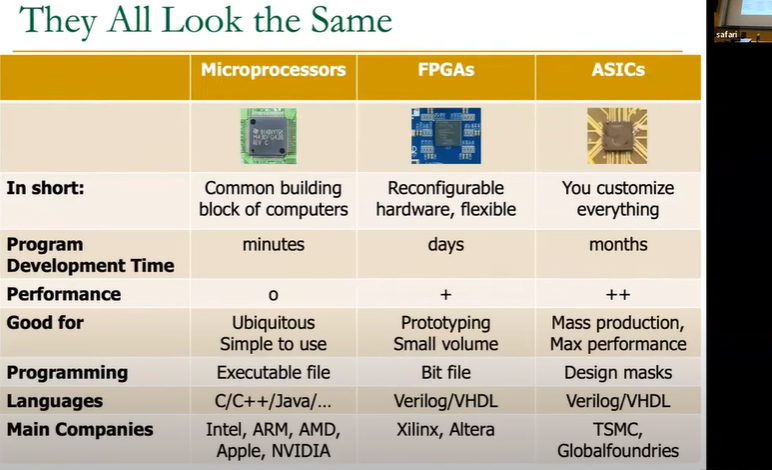

## Tradeoffs,Metrics and Mindset - Lecture 2a
- Computing is bottled by data and in many applications data is key:
    - important workloads are all data intensive.
    - They require rapid and efficient processing of large amounts of data
    - Data is increasing:
        - we can generate more than we can process.
### Memory Access:
- Data is the key for future workloads.
- Data movement overwhelms modern machines -> 62.7% of the total system energy is spent on data movement.
- Similarly > 90% of the total system energy is spent on memory in large ML models.
- Key thing: it goes through large interconnets, as it becomes bigger, it needs more enery, and the memroy access consumes ~100-1000x the energy of a complex addition.
- Comparing data from memory is much more expensive:f
    

- An SSD access can be about 6400x access most costly than an RAM.

### Many Novel Concepts are Being Investigated Nowadays:

- New computing paradigms(rethinking the full stack)
    - Processing in memory, processing near data
    - Neuromorphic computing, quantum computing 
    - Fundamentally secure and dependable computers 

- New accelerators and systems (algorithm-hardware co-design)
    - AI and ML
    - Graph and Data Analytics,Vision and Video
    - Genome Analysis 

- New Memories, Storage Systems ,Interconnects and Devices
    - Non-volatile main memory, intelligent memory systems,quantum computing 
    - High-Speed interconnects, Diaggregated Systems 

- As applications push boundaries, computing platforms will become increasingly diverging and complex systems.

### Computing Architecture Today 

- We can revolutionize the way computers are built,if we understand both the hardware and the sofware(and change each accordingly).
- We can invent new paradigms for computation, communication and storage.
- Ref: "The Structure of Scientific Revolutions" - Thomas Kuhn(1962) 
    - pre-paradigm science: no clear consensus in the field 
    - normal science: dominant theory used to explain/ improve things(business as usual); exceptions considered anomalies
    - Revolutionary science: underlying assumptions re-examined.

### Thinking Computer Architecture resembles building Real-world Architecture:
- Appreciate the beauty and out-of-the-box and creative thinking 
- Think about tradeoffs in the design:
    - strengths, weaknesses, goals of design 
- Derive principles on our own for good design and innovation.

### Basic Building Blocks

- Electrons 
- Transistors
- Logic Gates 
- Combinational Logic Circuits 
- Sequential Logic Circuits 
    - Storage elements and memory 
- Cores 
- Caches 
- Interconnect 
- Memories

## Lecture 2b: Combinational Logic 1 

- Much more capable if we master both hardware and software(and the interface bw them)
    - can develop better software if we understand the hardware
    - can develop better hardware if we understand the software
    - can design a better computing system if we understand both.

- this covers both HW/SW and microarchitecture

### Fundamentals:

- can only change the world, if we understand it well enough
    - especially the basics(fundamentals)
    - past and present dominant paradigms 
    - and their advantages and shortcomings - tradeoffs
    - and , what remains fundamental acorss generations.

- what is a computer:
    - 3 key components:
        - Computation 
        - Communication 
        - Storage / memory 
        

    - 

- Course Organization 
    - Part1:
        - Combinational Logic Design 
        - Hardware Description Language (Verilog)
        - Seqeuntial Logic Design 
        - Timing and Verification 
        - ISA (MIPS and LC3b as examples)
        - Assembly programming 
    - Part2:
        - Microarchitecture Fundamentals 
        - Single-cycle Microarchitectures 
        - Multi-cycle and Microprogrammed Microarchitectures 
        - Pipelining 
        - Issues in Pipelinig -> dependence handling, state maintenance and Recovery 
        - Branch Prediction 
        - Out-of-order Execution 
        - Superscalar Execution 
        - Other Paradigms: Dataflow, VLIW, Systolic, SIMD/GPUs.
    - Part3:
        - Memory Technology and Organization 
        - Memory Hierarchy 
        - Caches 
        - Multi-core caches 
        - Prefetching 
        - Virtual Memory 
- Processing Paradigms covered in the course:
    - Pipelining
    - Out-of-order execution 
    - Dataflow(ISA level)
    - Superscalar Execution 
    - VLIW 
    - Decoupled Access-Execute 
    - Systolic Arrays 
    - SIMD Processing (Vector and Array)
    - GPUs

### Fundamental Ideas :

- Transistors and Logic Gates.
- Boolean Algebra 
- Combinational Logic Circuits 
- How to use boolean algebra to represent combinational circuits 
- Minimizing Logic Circuits 
- General Purpose vs Special Purpose Systems 
    
    - CPUs are more flexible and can execute any program , Easy to program and use. Cons:  Not the best performance and efficiency.
    - ASICs and efficient and high performance. Usually difficult to program and use. Inflexible: Limited set of programs.

- These all look the same

- So by programming the FPGAs we build the microprocessors.

### Transistors:
- Computers are built from very large numbers of very small(and relatively simple) structures: transistors
	- Intel 4004, in 1971 had 2300 MOS transistors.
	- Intel's Pentium 4 microprocessor , 2000, was made up of more than 42 million MOS transistors 
	- Apple's M2 Max , offered for sale in 2022, is made up of more than 67 Billion MOS transistors.

### MOS Transistor
- By combining:
	- Conductors (Metal)
	- Insulators (Oxide)
	- Semiconductors 
- We get a Transistor(MOS)
- Why useful?
	- we can combine many of these to realize simple logic gates.
- The electrical properties of metal-oxide semiconductors are well beyond the scope of what we want to understand in this course.
	- They are below our lowest level of abstraction.

### Different Types of MOS Transistors:
- n-type and p-type.
- ![[Screenshot 2025-01-21 at 11.02.30 PM.png]]
- They both operate "logically".

### How does a Transistor Work ?
- ![[Screenshot 2025-01-21 at 11.05.59 PM.png]]
- In order for the lamp to glow, electrons must flow.
- In order for the electrons to flow, there must be a closed circuit from the power supply to the lamp and back to the power supply.
- The lamp can be turned on and off by simply manipulating the wall switch to make or break the closed circuit.
- Instead of the wall switch, we could use an n-type or a p-type MOS transistor to make or break the closed circuit.
- ![[Screenshot 2025-01-21 at 11.07.56 PM.png]]
- Depending on the technology, high voltage can range from 0.3V to 3V -> threshold voltage.
- If the gate of the n-type transistor is supplied with 0 voltage, the connection between the source and drain is broken.(i.e the circuit is open)
- ![[Screenshot 2025-01-21 at 11.10.34 PM.png]]
- In n-type we take advantage of the electron flow, while in p-type transistor we take advantage of the hole flow.

### Making logic blocks using CMOS Technology
- Modern computers use both n-type and p-type transistors i.e Complementary MOS (CMOS) technology.
- It is the simplest logic structure that exists in a modern computer.
- ![[Screenshot 2025-01-21 at 11.24.43 PM.png]]
- ![[Screenshot 2025-01-21 at 11.25.05 PM.png]]
- ![[Screenshot 2025-01-21 at 11.25.55 PM.png]]